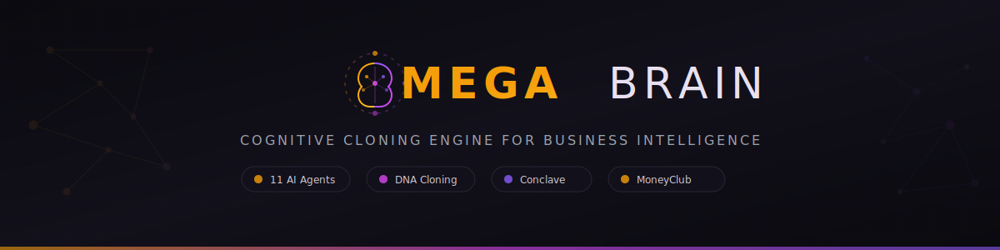

<p align="center">
  
</p>

<h1 align="center">Aureon AI</h1>

<p align="center">
  <strong>AI Knowledge Management System</strong>
  <br>
  Transform expert materials into structured playbooks, DNA schemas, and mind-clone agents.
</p>

<p align="center">
  
  
  
  
</p>

---

## What is Aureon AI?

Aureon AI is a [Claude Code](https://claude.ai/claude-code)-powered system that ingests expert materials — videos, PDFs, transcriptions, podcasts, training courses — and transforms them into structured knowledge. It produces playbooks, DNA schemas, and AI agents that reason with traced evidence.

Built to operationalize expertise at scale: ingest any material, generate specialist agents, organize them into SQUADs, and command them via a unified interface.

## Quick Start

```bash
# 1. Install dependencies (only in the first run)
npm install

# 2. Install and configure
npx aureon-ai setup

# 3. Fill in API keys when prompted (only OPENAI_API_KEY is required)

# 4. Open Claude Code and check system status
/aureon-status
```

Setup auto-triggers on first use if `.env` is missing.

### Prerequisites

| Requirement | Version | Notes |
|-------------|---------|-------|
| [Claude Code](https://claude.ai/claude-code) | Max or Pro plan | Core runtime |
| [Node.js](https://nodejs.org) | >= 18.0.0 | CLI and tooling |
| [Python](https://python.org) | >= 3.10 | Intelligence scripts |

### API Keys

| Key | Purpose | Required? |
|-----|---------|-----------| 
| `OPENAI_API_KEY` | Whisper transcription | **Yes** |
| `VOYAGE_API_KEY` | Semantic embeddings (RAG) | Recommended |
| `GOOGLE_CLIENT_ID` | Google Drive import | Optional |

Run `/setup` in Claude Code to configure keys interactively. Keys are stored in `.env` (gitignored).

## Features

### Knowledge Pipeline

- **Ingest** any format — videos, PDFs, transcriptions, podcasts, training courses
- **Extract** structured DNA across 5 knowledge layers (philosophies, mental models, heuristics, frameworks, methodologies)
- **Build** playbooks, dossiers, and theme-based knowledge bases with full source traceability

### AI Agents & SQUADs

- **Mind Clones** — AI agents that reason like specific experts, grounded in their actual materials
- **Cargo Agents** — Functional role agents (Sales, Marketing, Operations, Finance) that synthesize knowledge from multiple sources
- **SQUADs** — Organized teams of specialists by sector: Sales, Exec, Ops, Marketing, Tech, Research, Finance
- **Conclave** — Multi-agent deliberation sessions with evidence-based debate and structured output

### Developer Experience

- **20+ hooks** for automated validation, session management, and quality control
- **Slash commands** for common operations (`/ingest`, `/save`, `/resume`, `/conclave`)
- **Skill system** with keyword-based auto-routing
- **Session persistence** with auto-save and resume

## Architecture

```
aureon-ai/
├── core/           -> Processing engine (tasks, workflows, protocols, schemas)
├── agents/         -> AI agent definitions (squads, conclave, cargo, minds, templates)
│   └── squads/     -> SQUAD routers (sales, exec, ops, marketing, tech, research, finance)
├── bin/            -> CLI tools and entry points
├── .claude/        -> Claude Code integration (hooks, skills, commands, rules)
├── knowledge/      -> Knowledge base (playbooks, dossiers, DNA schemas)
├── artifacts/      -> Pipeline processing stages (chunks, insights, narratives)
├── inbox/          -> Raw materials input directory
├── docs/           -> Documentation, PRDs, plans
└── logs/           -> Session and processing logs
```

### Layer System

Content is organized into three distribution layers:

| Layer | Content | Distribution |
|-------|---------|--------------|
| **L1** (Community) | Core engine, templates, hooks, skills, CLI | npm package (public) |
| **L2** (Pro) | Populated knowledge base, mind clones, pipeline | Premium (tracked) |
| **L3** (Personal) | Your materials, sessions, environment config | Local only (gitignored) |

## Commands

Use these slash commands inside Claude Code:

| Command | Description |
|---------|-------------|
| `/aureon-status` | System status and health score |
| `/ingest` | Ingest new material into the pipeline |
| `/aureon-process` | Run the 5-phase processing pipeline |
| `/conclave` | Multi-agent deliberation session |
| `/save` | Save current session state |
| `/resume` | Resume previous session |
| `/setup` | Environment setup wizard |

## SQUADs

Squads are organized teams of specialists by sector:

| Squad | Specialists | Triggers |
|-------|-------------|---------|
| **Sales** | BDR, SDS, LNS, Closer, Sales Manager | vendas, pipeline, fechamento, objeção |
| **Exec** | CRO, CFO, COO | EBITDA, valuation, scaling, margem |
| **Ops** | OpsManager, ProcessAgent | processo, SOP, checklist, eficiência |
| **Marketing** | CMO, GrowthAgent, CopyAgent | marketing, tráfego, copy, conteúdo |
| **Tech** | ArchAgent, DevOps, AutomationAgent | código, sistema, deploy, automação |
| **Research** | ResearchAgent, AnalystAgent | pesquisar, analisar, mercado, dados |
| **Finance** | CFO, ControllerAgent, PricingAgent | financeiro, DRE, caixa, precificação |

## DNA Schema

Knowledge is extracted and structured in 5 layers:

| Layer | Name | Description |
|-------|------|-------------|
| L1 | **Philosophies** | Core beliefs and worldview |
| L2 | **Mental Models** | Thinking and decision frameworks |
| L3 | **Heuristics** | Practical rules and decision shortcuts |
| L4 | **Frameworks** | Structured methodologies and processes |
| L5 | **Methodologies** | Step-by-step implementations |

Every piece of extracted knowledge traces back to its source material with file path, line number, and original context.

## License

UNLICENSED — See [package.json](package.json) for details.
